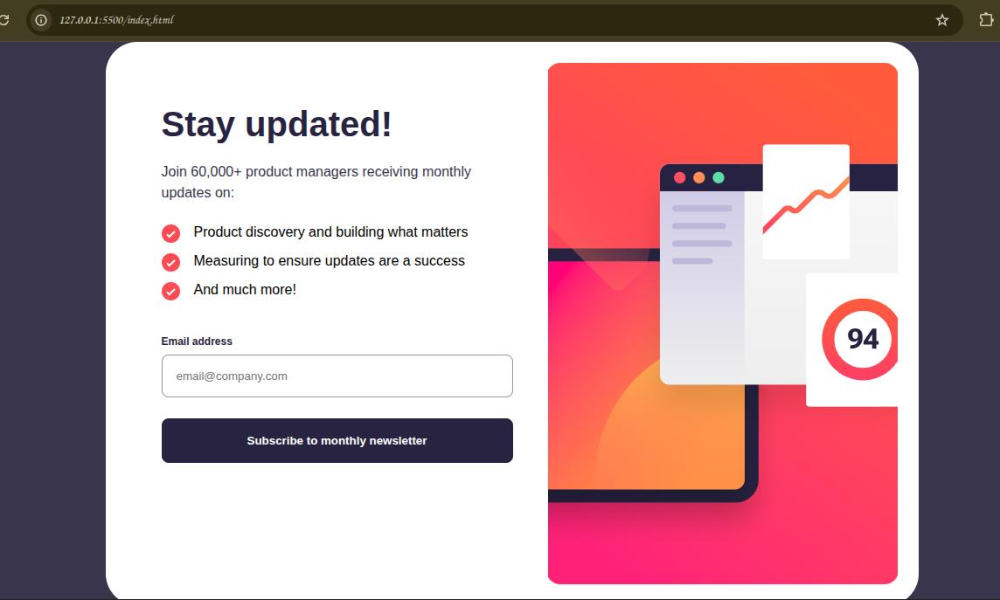

# Frontend Mentor - Newsletter sign-up form with success message solution

This is a solution to the [Newsletter sign-up form with success message challenge on Frontend Mentor](https://www.frontendmentor.io/challenges/newsletter-signup-form-with-success-message-3FC1AZbNrv). Frontend Mentor challenges help you improve your coding skills by building realistic projects. 

## Table of contents

- [Overview](#overview)
  - [The challenge](#the-challenge)
  - [Screenshot](#screenshot)
  - [Links](#links)
  - [Built with](#built-with)
  - [What I learned](#what-i-learned)
  - [AI Collaboration](#ai-collaboration)
- [Author](#author)
- [Acknowledgments](#acknowledgments)

**Note: Delete this note and update the table of contents based on what sections you keep.**

## Overview

### The challenge

Users should be able to:

- Add their email and submit the form
- See a success message with their email after successfully submitting the form
- See form validation messages if:
  - The field is left empty
  - The email address is not formatted correctly
- View the optimal layout for the interface depending on their device's screen size
- See hover and focus states for all interactive elements on the page

### Screenshot



This is A screenshot of the live Website.

### Links

- Live Site URL: [Newsletter](https://newsletter-sepia-five.vercel.app/)
- This is the live Site url. I used vercel to deploy this project.

### Built with

HTML
CSS 
JavaScript

### What I learned

I learned that even the seemingly tough challenges are easy once you know how to tackle them.

To see how you can add code snippets, see below:

```html
<h1>Some HTML code I'm proud of</h1>
```
```css
.proud-of-this-css {
  color: dark-slate-grey;
}
```
```js
const proudOfThisFunc = () => {
  console.log('email')
}
```

### AI Collaboration

- What tools did you use (e.g., ChatGPT, Claude, GitHub Copilot)?
---I used Gemini AI.
- How did you use them (e.g., debugging, generating boilerplate, brainstorming solutions)?
---I used Gemini AI to create a boiler plate for the CSS file to increase productivity.
- What worked well? What didn't?
--- Well, The Image did not show on the desktop version of the css code, so I had to put the images directly inside the HTML file for it to become Visible.

## Author

- Website - [Wisdom Onyekachukwu](https://profile-page-inky.vercel.app)
- Frontend Mentor - [@wizzyventor](https://www.frontendmentor.io/profile/wizzyventor)
- Telegram - [@wizzyventor](https://t.me/wizzyventor)


## Acknowledgments
My Current Front-End Teacher
